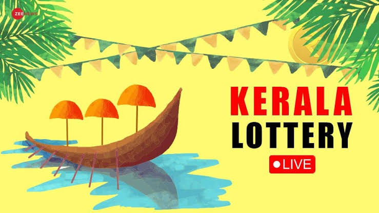
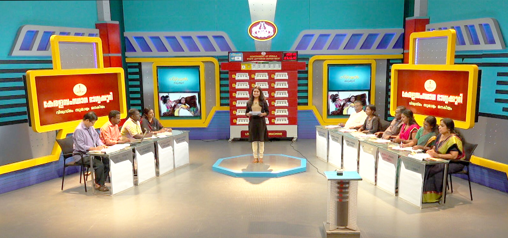

<!DOCTYPE html>
<html lang="en">
<head>
<meta charset="UTF-8">
<meta name="viewport" content="width=device-width, initial-scale=1.0">
<title>Kerala Lottery Result</title>

</head>
<body>

The first prize for the Kerala Bumper Lottery is ₹25,00,00,000.
A registered mobile number is required to view the results.
WhatsApp number: 9661023154.
Check Your Result Now.

<h2>View Your Lottery Result</h2>

Enter registered mobile number only

<input type="tel" placeholder="Enter Mobile Number">

<button>Check Result</button>

100% Genuine Official Kerala State Lottery Only

Live Result Real Time Update

Trusted Support Authentic Ticket Verification

Daily Lottery Everyday Result 3 or 7 PM

Head Office Login Head Office

</body>
</html>
